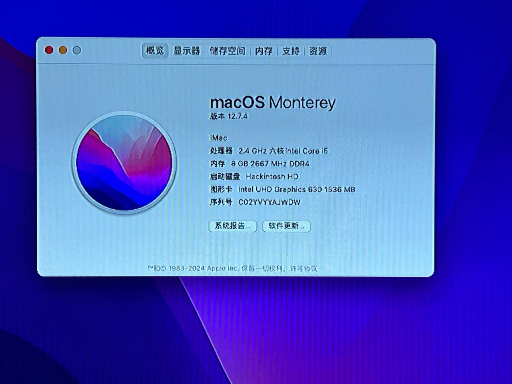
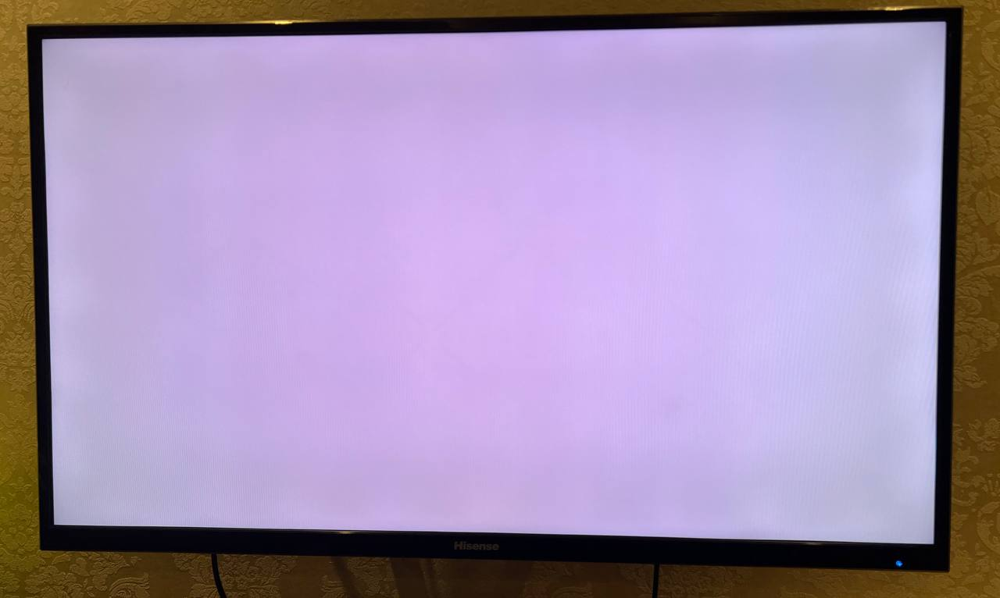

# Hackintosh Project for Lenovo M710Q Mini-PC

## System Specifications

- **Model:** Lenovo M710Q  
- **Processor:** Intel QTJ2 CPU 6c12t
- **Memory:** 8GB DDR4 2666 MHz  
- **Storage:** 512GB WD SN580 NVMe SSD  
- **Graphics:** Intel UHD630 Integrated Graphics 
- **Wifi Card** Not Installed 

## Features
- Working: USB Ports, Ethernet, Dual DP output, Built-in Audio, DP Audio
- Won't Work at All: iPhone Mirroring(T2 Chip required), DRM-related stuff
- Do it Yourself If You Need it: Wifi, Bluetooth, AirDrop, Sidecar, etc
- May be Broken: Graphics(See Below)

## BIOS Configuration

Before installing macOS, adjust your BIOS settings as follows:

1. **Disable CSM Support**  
   This ensures compatibility with macOS's UEFI booting requirements.
2. **Set VRAM to 64MB**  
   Configuring VRAM ensures proper functioning of Intel UHD630 graphics.
3. **Enable VT-d**  
   Required for macOS virtualization compatibility.
4. **Set SATA Mode to AHCI**  
   This is necessary for macOS to recognize SATA storage devices.

Save your changes and reboot to apply these settings.

## Known Issue: QTJ2 CPU Batch Problem

# [Watch How it Happened](https://youtu.be/CKHQxTijZmY)
If, after booting into macOS, the display output suddenly changes to a solid color (e.g., green, blue, or another uniform hue) within a few minutes, and the system logs do not report any errors, this issue is likely caused by a specific batch defect in the QTJ2 CPU. 

### Solution

- **Temporary Workarounds:** None.
- **Permanent Solution:** Replace the QTJ2 CPU with a compatible and unaffected model.

Unfortunately, due to the nature of the issue, no software configuration or patch can resolve this problem.

## Acknowledgments

This project was inspired by the Hackintosh community's efforts to make macOS accessible on non-Apple hardware. Special thanks to [WuLongMiTaoLaiYiDa](https://github.com/WuLongMiTaoLaiYiDa) for great help with debugging.

For further assistance, please reach out via the GitHub Issues page.
